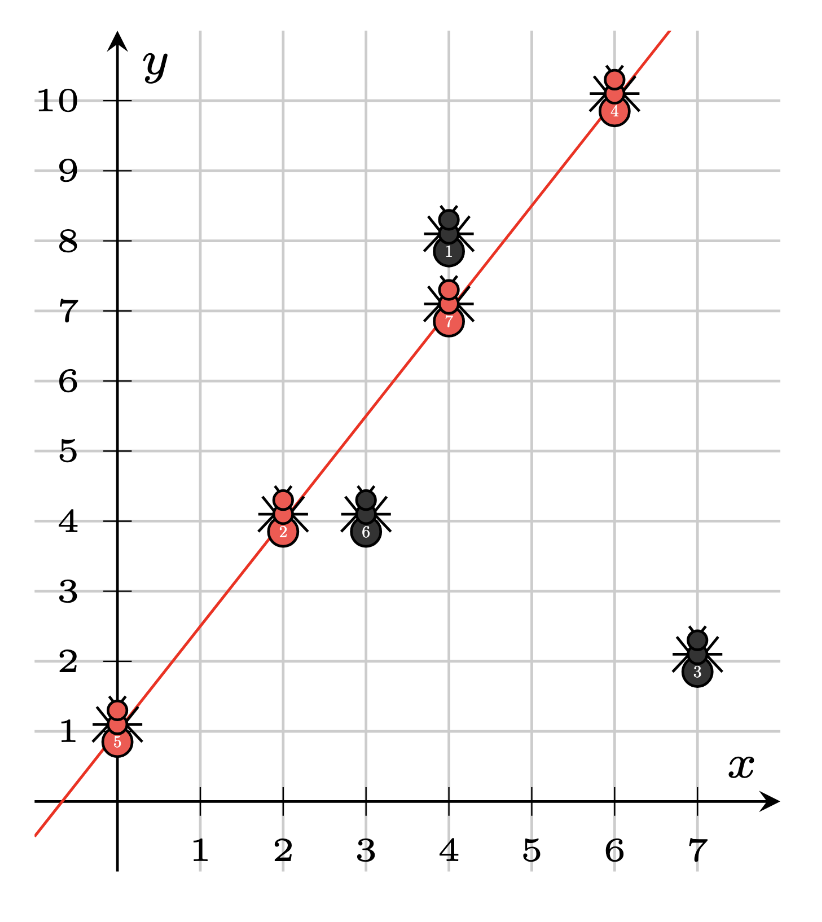

# Problem C: Fall in Line

As the queen of an ant colony, it’s your job to ensure that the entire colony works together. Your colony has 
N worker ants, the ith of which is currently at coordinates (Xi, Yi). To align the efforts of all of your worker ants, you would like them to all be on the same line on the plane. How many of your ants need to move to get them to all lie on the same line?

As is frequently the case in management, you don’t need an exact answer, but you do need some degree of accuracy. If the true minimum number of ants that need to move is M, then any answer between M and 2*M (inclusive) will be accepted.

## Constraints

1 ≤ T ≤ 75
2 ≤ N ≤ 1,000,000
0 ≤ ∣Xi∣, ∣Yi∣ ≤ 1,000,000,000

In each test case, no two ants will be at the same position.
The sum of N across all test cases is at most 4,000,000.

## Input Format

Input begins with an integer T, the number of test cases. Each case starts with a line that contains the integer N. Then N lines follow, the ith of which contains the integers Xi and Yi.

## Output Format

For the i-th test case, print "Case #i: " followed by the number of ants you need to move to get all of the ants to lie on the same line.

## Sample Explanation

In the first case, the 4 ants are all on the line y = x, so no ants need to be moved. 0 is the only answer that will be accepted for this case.

In the second case, the 4 ants are at the vertices of a square, so every line contains at most 2 of the 4 ants. 2 ants need to be moved, so the answers 2, 3, and 4 will be accepted for this case.

The third case is depicted below. Ants 2, 4, 5, and 7 all lie on the line y = 3/2 x + 1. Moving the other 3 ants is the optimal way to get all of the ants on a single line, so any answer between 3 and 6 inclusive will be accepted for this case.

