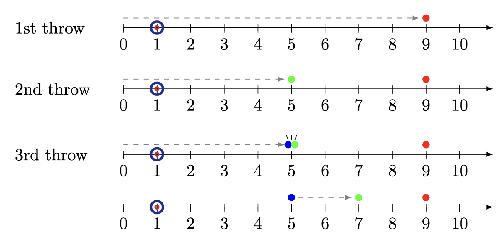

# Problem D1: Line of Delivery (Part 1)

This problem shares some similarities with problem D2, with key differences in **bold**.

Candice is playing a solitaire game of curling on a 1-dimensional sheet of ice, **using stones of negligible size**. She will throw N stones (numbered 1 to N) from position 0, targeting a position G units to the right. In curling, though we say a stone is “thrown”, it’s actually slid along the ice.

The i-th stone will be thrown with energy E_i, and will travel E_i units to the right unless it collides with another stone, in which case it will transfer its remaining energy to the stone it hits. Formally, we repeat this process until all stones are stationary:

- **If the moving stone is at the same position as a stationary stone, the moving stone stops, and the stone it hits is now the moving stone with the remaining energy of the previous moving stone.**
- Otherwise, the moving stone moves 1 unit to the right and its energy is reduced by 1. If the moving stone now has energy 0, it becomes stationary.

After all of the stones are thrown, which stone is closest to the goal position G, and how far away from the goal is it?

## Constraints

- 1 ≤ T ≤ 85
- 1 ≤ N ≤ 300,000
- 1 ≤ E_i, G ≤ 1,000,000
- In each test case, no two stones are thrown with the same energy.
- The sum of N across all test cases is at most 2,000,000.

## Input Format

Input begins with an integer T, the number of test cases. Each case starts with a line that contains the integers N and G. Then N lines follow, the i-th of which contains E_i.

## Output Format

For the i-th test case, print "Case #i: " followed by the index of the stone that ends up closest to the goal, G, and how far away it is from G. If there’s a tie, output the stone with the lowest index.

## Sample Explanation

In the first case, no stones collide. They end up at positions 7 and 2 respectively, so the first stone is the closest to the goal (5) and is 2 units away.

The second case is depicted below. The third stone collides with the second stone, stopping at position 5, while the second stone then continues on to position 7. The final positions of the stones in order are [9, 7, 5]. The third stone is the closest to the goal (1) and ends up 4 units away.

In the third case, the final positions of the stones are [9, 8, 7, 6], so the third stone ends up exactly on the goal.

In the fourth case, both stones are equally distant from the goal. We break ties by picking the lower index.