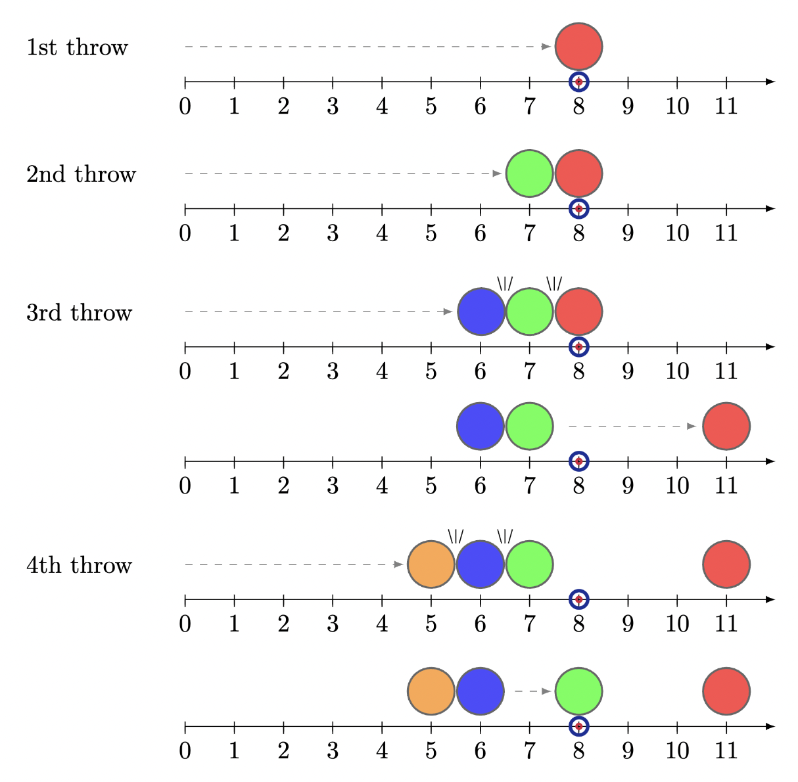

# Problem D2: Line of Delivery (Part 2)

This problem shares some similarities with problem D1, with key differences in **bold**.

Candice is playing a solitaire game of curling on a 1-dimensional sheet of ice, **using stones that are 1 unit wide**. She will throw N stones (numbered 1 to N) from position 0, targeting a position G units to the right. In curling, though we say a stone is “thrown”, it’s actually slid along the ice.

The i-th stone will be thrown with energy Ei, and will travel Ei units to the right unless it collides with another stone, in which case it will transfer its remaining energy to the stone it hits. Formally, we repeat this process until all stones are stationary:

- **If the moving stone is at position p and there is a stationary stone at position p+1, the moving stone stops at position p, and the stone at position p+1 is now the moving stone with the remaining energy of the previous moving stone**.
- Otherwise, the moving stone moves 1 unit to the right and its energy is reduced by 1. If the moving stone now has energy 0, it becomes stationary.

After all of the stones are thrown, which stone is closest to the goal position G, and how far away from the goal is it?

## Constraints
- 1 ≤ T ≤ 80
- 1 ≤ N ≤ 300,000
- 1 ≤ G ≤ 1,000,000
- N ≤ Ei ≤ 1,000,000

**All stones are thrown with energy Ei ≥ N, so that stones do not pile up near Candice, but the energies are not necessarily unique.**

The sum of N across all test cases is at most 2,000,000.

## Input Format
Input begins with an integer T, the number of test cases. Each case starts with a line that contains the integers N and G. Then N lines follow, the ith of which contains Ei.

## Output Format

For the i-th test case, print "Case #i: " followed by the index of the stone that ends up closest to the goal, G, and how far away it is from G. If there’s a tie, output the stone with the lowest index.

## Sample Explanation

The third sample case is depicted below. The first stone stops at position 8, and the second stone stops at position 7. The third stone starts with an energy of 9, but stops at position 6, transferring 3 energy to the second stone. The second stone is already touching the first stone, so it transfers 3 energy to the first stone, which then moves to position 11. The fourth stone starts with energy 6, and stops at position 5, transferring 1 energy to the next stone, which again transfers 1 energy to the next stone, which then moves to position 8. So the final positions of the stones are [11, 8, 6, 5] with stone 2 being at position 8, the goal.

